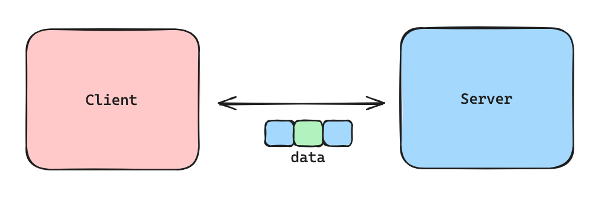

# IRC Server Development with RFC Protocol Compliance

<p align="center">
  
</p>

**Ft_irc (Internet Relay Chat)**

The aim of this project is to create our own IRC server in C++. IRC is a text-based communication protocol used for real-time messaging.

***Developed on Linux***

### Purpose:
1. peer-to-peer communication
2. group communication
3. data transfer

## Table of Contents

- [Installation](#installation)
- [Usage](#usage)
- [Definitions](#definitions)
- [References](#references)
- [Technical Skills](#technical-skills)

## Installation

Simply clone the project, and, since we have a Makefile up and ready, just enter the command at the root of the project:

```bash
make
```

We should have an **ircserv** executable located at the root of the directory.

## Usage

The ircserv executable after compiling the project will need the 2 following arguments: <br>
```bash
./ircserv <port> <password>
```
Where:
1. __port__: port on which the server will listen to for incoming IRC connections.
2. __password__: the password that the IRC client will require in order to connect to the server.

## Requirements
- Capable of handling multiple clients simultaneously, and never hang.
- Forking is forbidden. All Input/Output must be non-blocking.
- Only 1 poll()$*^1$ (or other equivalent like select(), kqueue(), or epoll()) can be used for handling all these operations (read, write, but also listen, and so forth).

> If we try to read/reacv or write/send in any file descriptor without the use of poll() or equivalent, that's cheating.

- Several IRC client exist. We have chosen Irssi.

- Communication between the two is done via TCP/IP (v4 or v6) protocol.

## Definitions
- **socket**: socket is a file descriptor. It is used to send/receive data over a network. They are used to create a connection between 2 endpoints.



```c
#include <sys/socket.h>

int	socket(int domain, int type, int protocol)
```

1. `domain` => specifies the domain for the socket.
	- `AF_INET`: This specifies the Internet Protocol version 4 (IPv4) communication domain.

	- `AF_INET6`: This specifies the Internet Protocol version 6 (IPv6) communication domain.

	- `AF_UNIX`: This specifies the Unix domain communication domain.

2. `type` => type of socket to be created.
	- `SOCK_STREAM`: This specifies a stream-oriented socket, which provides a reliable, connection-oriented byte stream. This is typically used for TCP connections.

	- `SOCK_DGRAM`: This specifies a datagram-oriented socket, which provides a connectionless, unreliable message delivery service. This is typically used for UDP connections.

3. `protocol` => protocol to be used with the socket.
	- can be set to 0 to use the default protocol for the specified domain and type.

***

- **setsockopt**: used to set options on a socket. Prevents error such as: “address already in use”.

> `SO_REUSEADDR` arg tells the OS that calls to bind() this socket are allowed to reuse a local address; this is particularly useful when stopping and then quickly restarting a server, since otherwise the address you want to bind to might still be allocated to the previous server instance, and thus your server won't be able to bind() to it for several minutes.<br>
https://stackoverflow.com/questions/69923217/what-exactly-is-the-purpose-of-setsockopt

> `SO_REUSEPORT` tells the OS that you'd like to allow multiple sockets to bind to the same socket address simultaneously; it's useful e.g. when running multiple clients that all want to receive the multicast or broadcast traffic coming in on a given port simultaneously.

```c
#include <sys/types.h>
#include <sys/socket.h>

int setsockopt(int sockfd, int level, int optname, const void *optval, socklen_t optlen);
```
1. `sockfd` => file descriptor of the socket on which the option is to be set.
2. `level` => specifies the protocol level at which the option is defined.
3. `optname` => parameter specifies the option name.
4. `optval` => pointer to the value of the option.
4. `optlen` => size of the option value.

## Technical Skills:

- Network Programming:
Developed a fully compliant IRC server based on the [RFC 2119](https://modern.ircdocs.horse/) protocol.
Managed connections, message parsing, and user commands using low-level socket programming.

- Concurrency:
Implemented multi-client support using asynchronous I/O to handle multiple connections simultaneously.

- Protocol Implementation:
Followed the IRC RFC 2119 standards to ensure correct command handling, error messaging, and client-server communication.

- Error Handling and Debugging:
Utilized tools such as Valgrind to debug and handle runtime errors, memory leaks, and segmentation faults.

- Security:
Implemented basic security features like password protection, user authentication, and channel modes to control access and permissions.

- Testing:
Conducted extensive testing, including unit tests and stress tests, to ensure the server’s stability and protocol adherence under various scenarios.

- Version Control:
Used Git for version control, enabling effective collaboration and code management within the team.

## References

Here are some references that you may find helpful:

- [IRC Protocol](https://tools.ietf.org/html/rfc1459)
- [Socket Programming in C](https://www.geeksforgeeks.org/socket-programming-cc/)
- [Linux man pages for socket](https://man7.org/linux/man-pages/man2/socket.2.html)
- [Linux man pages for setsockopt](https://man7.org/linux/man-pages/man2/setsockopt.2.html)
- [TCP/IP Sockets in C](https://beej.us/guide/bgnet/html/)
- [RFC 1459 IRC :Replies](http://www.iprelax.fr/irc/irc_rfcus6.php)
- [RFC 2119](https://modern.ircdocs.horse/)
